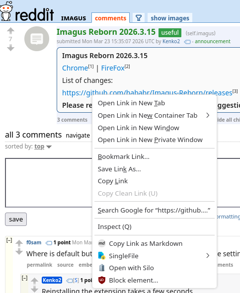

# Open with Silo

A Firefox extension that adds "Open with Silo" to the right-click context menu on any link. Sends the URL to [Silo](https://github.com/no-faff/Silo), a browser picker for Linux, so you can choose which browser or profile to open it in.



## Requirements

- Firefox
- [Silo](https://github.com/no-faff/Silo) installed
- Python 3

## Install

### 1. Install the native messaging host

The native messaging host is a small Python script that bridges Firefox and Silo.

Copy the host script:

```bash
sudo mkdir -p /usr/lib/silo
sudo cp native-host/silo-host.py /usr/lib/silo/
sudo chmod +x /usr/lib/silo/silo-host.py
```

Register it with Firefox:

```bash
mkdir -p ~/.mozilla/native-messaging-hosts
cp native-host/com.nofaff.silo.json ~/.mozilla/native-messaging-hosts/
```

### 2. Install the extension

The extension will be available on [Firefox Add-ons](https://addons.mozilla.org/) once published.

To install manually from source:

```bash
cd /path/to/silo-firefox-extension
zip -r silo-firefox.xpi manifest.json background.js icons/
```

Then open `about:addons` in Firefox, click the gear icon, "Install Add-on From File" and select the `.xpi` file.

Note: unsigned extensions require `xpinstall.signatures.required` set to `false` in `about:config`. This only works in Firefox Developer Edition or unbranded builds, not standard Firefox.

## How it works

1. Right-click any link in Firefox
2. Click "Open with Silo"
3. Silo's picker appears, letting you choose a browser or profile

**Note:** Each browser row in Silo's picker has an "Always" button that creates a rule for that domain. If you click it, that domain will skip the picker and open silently in your chosen browser next time you use "Open with Silo".

The originating site sees nothing. No data is sent to the site about the redirect.

## See also

- [Silo](https://github.com/no-faff/Silo) - the browser picker itself
- [Find](https://github.com/no-faff/ulauncher-find) - Ulauncher extension for finding files instantly

## Licence

MIT
